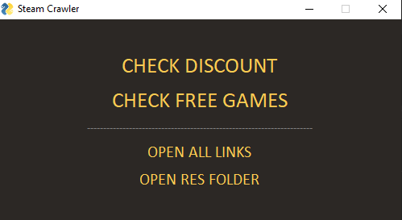

# Steam Crawler

A desktop application that scrapes Steam for discounts and free games (games with %100 discount).

 

Uses PySimpleGUI, requests and BeautifulSoup4 modules from pip.

 

# Exporting

To export this Python application into an executable, run the export.bat file after filling your Python environment path. It will create an .exe file in your root folder and also clean up garbage folders like build and dist.

# Licensing

This project is licensed under the terms of the Apache-2.0 license. 

<small>NOTE: PySimpleGUI is LGPLv3+, requests is Apache-2.0 and BeautifulSoup4 is MIT</small>

